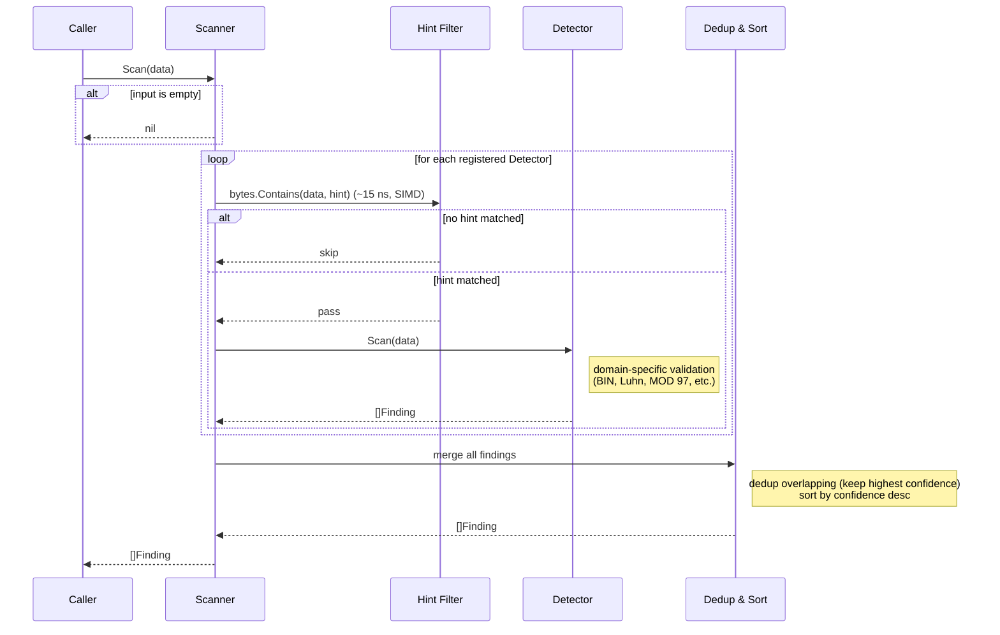

# sensitive

[](https://pkg.go.dev/github.com/nao1215/sensitive)
[](https://github.com/nao1215/sensitive/actions/workflows/coverage.yml)
[](https://github.com/nao1215/sensitive/actions/workflows/unit_test.yml)


**sensitive** is a Go library that detects sensitive data in text. It scans for credit card numbers, email addresses, Japanese phone numbers, Japanese My Number, JWTs, AWS access keys, IBANs, IP addresses, Bitcoin addresses, and Ethereum addresses, returning the position, type, and confidence level of each match. It also includes international and fintech-focused detectors such as SWIFT/BIC, US ABA routing numbers, UK sort codes, payment tokens, card CVV/expiry, and ACH trace numbers, plus developer credential detectors for GitHub tokens, Slack tokens, Google API keys, and PEM private keys. Masking is available as an optional helper, but detection is the core focus.

The library has zero external dependencies and relies only on the Go standard library.

## Requirements

- Go Version: 1.22 or later
- Operating Systems (tested on):
  - Linux
  - macOS
  - Windows


## Installation

```bash
go get github.com/nao1215/sensitive
```

## Quick Start

Create a Scanner, choose which detectors to enable, call `ScanString`, and optionally mask findings:

```go
package main

import (
    "fmt"

    "github.com/nao1215/sensitive"
    "github.com/nao1215/sensitive/detector"
    "github.com/nao1215/sensitive/mask"
)

func main() {
    scanner := sensitive.NewScanner(sensitive.WithAll())
    text := "user tanaka@example.com paid with 4532015112830366"
    findings := scanner.ScanString(text)

    for _, f := range findings {
        fmt.Printf("type=%s raw=%s confidence=%.2f\n",
            f.DetectorName, f.RawValue, f.Confidence)
    }

    masked := mask.Mask(text, findings, map[sensitive.DetectorName]mask.Strategy{
        detector.NamePAN:   mask.Last4,
        detector.NameEmail: mask.Partial,
    })
    fmt.Println(masked)
}
```

Output (order may vary):

```
type=pan raw=4532015112830366 confidence=1.00
type=email raw=tanaka@example.com confidence=1.00
user t*****@example.com paid with ************0366
```

`WithAll()` turns on every built-in detector. If you only care about specific types, pick them individually:

```go
scanner := sensitive.NewScanner(sensitive.WithPAN(), sensitive.WithEmail())
```

> **Caution on `WithAll()`:** `WithAll()` enables *all* built-in detectors, including context-based weak detectors (`WithBankAccount`, `WithACHTrace`, `WithMerchantID`, `WithCVV`, `WithCardExpiry`). These detectors rely on nearby keywords rather than checksums and may produce false positives. In strict/financial-audit scenarios where false positive cost is high, avoid `WithAll()` and enable only the specific detectors you need.

> **Note:** `NewScanner()` with no options creates a scanner with zero detectors, so `Scan` will always return an empty result. You must pass at least one `With*()` option to enable detection.

**Common mistakes:**

```go
// Mistake 1: No detectors — always returns empty results.
scanner := sensitive.NewScanner()
findings := scanner.ScanString("4532015112830366") // findings is empty!

// Mistake 2: WithAll() in strict mode produces noise from weak detectors.
// Use specific options instead.
scanner = sensitive.NewScanner(sensitive.WithPAN(), sensitive.WithEmail())
```

## Supported Detectors

| Option | Detects | Validation |
|--------|---------|------------|
| `WithPAN()` | Credit card numbers (Visa, Mastercard, Amex, JCB, Discover, Diners, UnionPay) | BIN prefix + Luhn algorithm |
| `WithEmail()` | Email addresses | Structure + known TLD check |
| `WithJPPhone()` | Japanese phone numbers (mobile, landline, IP phone, toll-free, M2M/IoT, service) | Prefix classification + digit count |
| `WithMyNumber()` | Japanese My Number (12-digit individual number) | MOD 11 check digit |
| `WithJWT()` | JSON Web Tokens | Header decode + `alg` key check |
| `WithAWSKey()` | AWS Access Key IDs (`AKIA...` / `ASIA...`) | Prefix + 20-char alphanumeric |
| `WithIBAN()` | International Bank Account Numbers | Country code + MOD 97 check digit |
| `WithIPAddr()` | IPv4 and IPv6 addresses | `net.ParseIP` + octet range |
| `WithSWIFTBIC()` | SWIFT/BIC codes | Format + country code validation |
| `WithABARouting()` | US ABA routing numbers | Prefix range + checksum |
| `WithUKSortCode()` | UK sort codes (XX-XX-XX) | Pattern + boundary checks |
| `WithCVV()` | Card verification values (CVV/CVC/CID) | Context keyword + digit length (context-based, weaker) |
| `WithCardExpiry()` | Card expiration dates | Context keyword + MM/YY validation (context-based, weaker) |
| `WithPaymentToken()` | Payment processor tokens (Stripe/PayPal/Square) | Prefix + minimum body length |
| `WithBankAccount()` | Bank account numbers (context-based) | Context keyword + digit range (context-based, weaker) |
| `WithACHTrace()` | ACH trace numbers | Context keyword + prefix range (context-based, weaker) |
| `WithMerchantID()` | Merchant/terminal IDs | Context keyword + format (context-based, weaker) |
| `WithBTC()` | Bitcoin addresses (P2PKH, P2SH, Bech32, Bech32m/Taproot) | Base58Check (double SHA-256) / Bech32 polynomial checksum |
| `WithETH()` | Ethereum addresses (0x + 40 hex) | EIP-55 mixed-case checksum (Keccak-256) |
| `WithGitHubToken()` | GitHub tokens (classic `ghp_`/`gho_`/`ghu_`/`ghs_`/`ghr_`, fine-grained `github_pat_`) | Prefix + body character set + minimum length |
| `WithSlackToken()` | Slack API tokens (`xoxb-`/`xoxp-`/`xoxa-`/`xoxo-`/`xoxr-`/`xoxs-`) | Prefix + type character + minimum body length |
| `WithGoogleAPIKey()` | Google API keys (`AIza...`) | Prefix + 35-char body |
| `WithPrivateKeyPEM()` | PEM private key headers (RSA/EC/DSA/OpenSSH/PKCS#8) | `-----BEGIN [ALGO ]PRIVATE KEY-----` header parse |
| `WithAll()` | All of the above | |

## Benchmarks

**Measurement conditions:**

- **Command:** `go test -bench BenchmarkScanner -benchmem -benchtime 3s -count 5 -run '^$'`
- **Go version:** 1.24 (linux/amd64)
- **GOMAXPROCS:** 16
- **CPU:** AMD RYZEN AI MAX+ 395 w/ Radeon 8060S
- **Commit:** [b7e0cdc](https://github.com/nao1215/sensitive/commit/b7e0cdc)

To reproduce, run the command above. Use `-count 5` and take the median for stable results.
Benchmark numbers are environment-sensitive. Expect variation across Go versions, CPUs, and background load, and refresh results periodically if you publish them for compliance or audit purposes.

### Per-detector benchmarks (single detector enabled)

| Benchmark | ns/op | B/op | allocs/op |
|-----------|-------|------|-----------|
| PAN | 286.7 | 944 | 16 |
| Email | 188.2 | 288 | 9 |
| JPPhone | 171.3 | 464 | 8 |
| MyNumber | 142.0 | 392 | 6 |
| JWT | 1001 | 1208 | 25 |
| AWSKey | 147.1 | 280 | 8 |
| IBAN | 205.7 | 226 | 6 |
| IPAddr | 209.8 | 312 | 10 |
| SWIFTBIC | 176.1 | 288 | 9 |
| ABARouting | 132.7 | 376 | 6 |
| UKSortCode | 128.4 | 248 | 8 |
| CVV | 289.6 | 568 | 18 |
| CardExpiry | 261.4 | 456 | 16 |
| PaymentToken | 276.7 | 688 | 20 |
| BankAccount | 435.1 | 760 | 22 |
| ACHTrace | 325.9 | 480 | 17 |
| MerchantID | 343.4 | 568 | 18 |
| BTC | 514.5 | 328 | 7 |
| ETH | 2118 | 329 | 7 |

### Multi-detector and edge-case benchmarks

| Benchmark | Description |
|-----------|-------------|
| `BenchmarkScannerNoMatch` | All detectors enabled, input with no sensitive data. Note: detectors with nil hints (IBAN, SWIFT/BIC, ABA, MyNumber) always run regardless of input content. |
| `BenchmarkScannerAllDetectors` | All detectors enabled, input containing email + PAN + IP |
| `BenchmarkScannerEmptyInput` | All detectors enabled, nil input |
| `BenchmarkScannerLargeInput` | All detectors enabled, ~4KB log block with no sensitive data |
| `BenchmarkScannerHintMatchNoDetection` | All detectors enabled, hints match but no valid sensitive data found |
| `BenchmarkScannerFullWidthInput` | All detectors enabled, full-width digit input requiring normalization |

## Scanning Streams

For log files and other line-oriented input, use `ScanLines` to process data incrementally without loading the entire content into memory. The callback is invoked only for lines that contain findings:

```go
f, _ := os.Open("access.log")
defer f.Close()

scanner := sensitive.NewScanner(sensitive.WithAll())
err := scanner.ScanLines(f, func(lineNum int, line []byte, findings []sensitive.Finding) {
    for _, finding := range findings {
        fmt.Printf("line %d: %s (%s)\n", lineNum, finding.DetectorName, finding.RawValue)
    }
})
if err != nil {
    log.Fatal(err)
}
```

If the entire content fits in memory, `ScanReader` is a simpler alternative:

```go
f, _ := os.Open("data.txt")
defer f.Close()

findings, err := scanner.ScanReader(f)
```

## Confidence Filtering

Use `WithMinConfidence` to control the strictness of detection. Findings below the threshold are filtered out:

```go
// Strict mode: only high-confidence findings (>= 0.8).
scanner := sensitive.NewScanner(sensitive.WithAll(), sensitive.WithMinConfidence(0.8))

// Loose mode: include medium-confidence and above (>= 0.4).
scanner = sensitive.NewScanner(sensitive.WithAll(), sensitive.WithMinConfidence(0.4))
```

This is useful for suppressing noise from context-based weak detectors (BankAccount, CVV, CardExpiry, etc.) while keeping strong checksum-validated results.

## Classifying Findings by Kind

Each finding has a `Kind()` method that returns a broad semantic category (`financial`, `pii`, or `credential`), enabling downstream classification without switching on all detector names:

```go
for _, f := range findings {
    switch f.Kind() {
    case detector.KindFinancial:
        // PAN, IBAN, ABA routing, sort code, CVV, card expiry, etc.
    case detector.KindPII:
        // email, phone, My Number, IP address
    case detector.KindCredential:
        // JWT, AWS key, payment token
    }
}
```

## Working with Findings

Each `Finding` contains the detector name, byte offsets, confidence score (0.0--1.0), the raw matched string, and a Detail struct with detector-specific information.

> **Note:** `Start` and `End` are **byte offsets**, not rune (character) offsets. For multi-byte UTF-8 text (e.g., Japanese), use the byte positions directly when slicing `[]byte` data.
>
> Context-based detectors (`WithBankAccount`, `WithACHTrace`, `WithMerchantID`, `WithCVV`, `WithCardExpiry`) rely on nearby keywords rather than checksums, so they are more prone to false positives than checksum-validated detectors. Confidence scores vary by detector: `WithBankAccount` returns 0.50--0.65, `WithMerchantID` and `WithACHTrace` return 0.70--0.75, and `WithCVV` and `WithCardExpiry` return 0.85.

### Checking the detector type

```go
for _, f := range findings {
    if f.IsPAN() {
        // handle credit card
    }
    if f.IsEmail() {
        // handle email
    }
}
```

There is also a generic `Is` method that takes a detector name constant:

```go
if f.Is(detector.NamePAN) { ... }
```

### Confidence levels

Confidence is a float between 0.0 and 1.0. When you do not need the exact score, use `Level()` to get a categorical assessment:

```go
switch f.Level() {
case detector.ConfidenceHigh:   // >= 0.8
case detector.ConfidenceMedium: // >= 0.4
case detector.ConfidenceLow:    // < 0.4
}
```

### Getting detector-specific details

Every finding carries a `Detail` field. Instead of type-asserting it yourself, use the typed accessor methods. Each returns a pointer and a boolean indicating success:

```go
scanner := sensitive.NewScanner(sensitive.WithPAN())
findings := scanner.ScanString("4532015112830366")

if detail, ok := findings[0].PANDetail(); ok {
    fmt.Println(detail.Brand)  // "Visa"
    fmt.Println(detail.Last4)  // "0366"
    fmt.Println(detail.Luhn)   // true
}
```

The available accessors and their fields:

| Method | Fields |
|--------|--------|
| `PANDetail()` | Brand, BIN, Last4, Luhn, Length |
| `EmailDetail()` | Local, Domain |
| `JPPhoneDetail()` | PhoneType (`JPPhoneTypeMobile`, `JPPhoneTypeLandline`, `JPPhoneTypeIPPhone`, `JPPhoneTypeTollFree`, `JPPhoneTypeM2M`, `JPPhoneTypeService`) |
| `JWTDetail()` | Algorithm (e.g. `HS256`, `RS256`) |
| `AWSKeyDetail()` | KeyType (`AWSKeyTypeLongTerm` or `AWSKeyTypeTemporary`) |
| `IBANDetail()` | CountryCode (ISO 3166-1 alpha-2) |
| `IPAddrDetail()` | Version (4 or 6) |
| `MyNumberDetail()` | CheckDigitValid |
| `BTCDetail()` | AddressType (`BTCAddressP2PKH`, `BTCAddressP2SH`, `BTCAddressBech32`, `BTCAddressBech32m`) |
| `ETHDetail()` | EIP55 (bool, whether EIP-55 checksum validated) |
| `GitHubTokenDetail()` | TokenType (`GitHubTokenClassic` or `GitHubTokenFineGrained`) |
| `SlackTokenDetail()` | TokenType (`SlackTokenBot`, `SlackTokenUser`, `SlackTokenApp`, `SlackTokenOAuth`, `SlackTokenRefresh`, `SlackTokenServiceRefresh`) |
| `GoogleAPIKeyDetail()` | (no fields) |
| `PrivateKeyPEMDetail()` | KeyType (algorithm named in the header, e.g. `RSA`, `EC`, `OPENSSH`, or empty for PKCS#8) |

## Masking

The `mask` sub-package provides five masking strategies:

| Strategy | Example |
|----------|---------|
| `Redact` | `4532015112830366` -> `****************` |
| `Last4` | `4532015112830366` -> `************0366` |
| `First1Last4` | `4532015112830366` -> `4***********0366` |
| `Partial` | `tanaka@example.com` -> `t*****@example.com` |
| `Hash` | `4532015112830366` -> `a8f5f167` (SHA-256 prefix) |

Use `mask.Mask` to apply different strategies per detector:

```go
import (
    "github.com/nao1215/sensitive"
    "github.com/nao1215/sensitive/detector"
    "github.com/nao1215/sensitive/mask"
)

scanner := sensitive.NewScanner(sensitive.WithPAN(), sensitive.WithEmail())
text := "user tanaka@example.com paid with 4532015112830366"
findings := scanner.ScanString(text)

masked := mask.Mask(text, findings, map[sensitive.DetectorName]mask.Strategy{
    detector.NamePAN:   mask.Last4,
    detector.NameEmail: mask.Partial,
})

fmt.Println(masked)
// user t*****@example.com paid with ************0366
```

If you want the same strategy for everything, use `mask.MaskAll`:

```go
masked := mask.MaskAll(text, findings, mask.Redact)
// user ****************** paid with ****************
```

## Custom Detectors

You can add your own detectors. The simplest way is `detector.NewRegex`, which wraps a compiled regular expression:

```go
import (
    "regexp"

    "github.com/nao1215/sensitive"
    "github.com/nao1215/sensitive/detector"
)

ticketDetector := detector.NewRegex(
    detector.DetectorName("ticket_id"),
    regexp.MustCompile(`TICKET-\d{4}`),
    [][]byte{[]byte("TICKET-")},   // hint for pre-filtering
    0.9,                            // fixed confidence
)

scanner := sensitive.NewScanner(
    sensitive.WithPAN(),
    sensitive.WithDetector(ticketDetector),
)
```

The hints parameter is important for performance. The scanner uses `bytes.Contains` to check hints before calling `Scan`, so a good hint lets the scanner skip the regex entirely for inputs that cannot match.

For more complex logic, implement the `Detector` interface directly:

```go
type Detector interface {
    Name() detector.DetectorName
    Hints() [][]byte
    Scan(data []byte) []detector.Finding
}
```

## Full-Width Digit Support

Japanese text often uses full-width digits (０-９). Detectors that parse digit sequences directly (PAN, JPPhone, MyNumber, ABA routing, BankAccount) normalize full-width digits to half-width before detection, so a phone number written as `０９０－１２３４－５６７８` or a bank account number written as `口座番号 １２３４５６７８` is correctly recognized. IBAN and UK sort code do **not** normalize full-width digits because their formats are primarily used in Western contexts where full-width encoding is uncommon. Context-based detectors (CVV, CardExpiry, ACHTrace, MerchantID) also do **not** normalize full-width digits. The utility function is also available for direct use:

```go
normalized, posMap := detector.NormalizeFullWidthDigits([]byte("０９０－１２３４－５６７８"))
fmt.Println(string(normalized)) // 090-1234-5678
```

## How It Works

The scanner runs a multi-stage filtering pipeline to keep scan cost low.



## Contributing

Contributions are welcome!

If you would like to send comments such as "find a bug" or "request for additional features" to the developer, please use one of the following contacts.

- [GitHub Issue](https://github.com/nao1215/sensitive/issues)


## Contributors ✨

Thanks goes to these wonderful people ([emoji key](https://allcontributors.org/docs/en/emoji-key)):

<!-- ALL-CONTRIBUTORS-LIST:START - Do not remove or modify this section -->
<!-- prettier-ignore-start -->
<!-- markdownlint-disable -->
<table>
  <tbody>
    <tr>
      <td align="center" valign="top" width="14.28%"><a href="https://debimate.jp/"><br /><sub><b>CHIKAMATSU Naohiro</b></sub></a><br /><a href="https://github.com/nao1215/sensitive/commits?author=nao1215" title="Code">💻</a> <a href="https://github.com/nao1215/sensitive/commits?author=nao1215" title="Documentation">📖</a></td>
    </tr>
  </tbody>
</table>

<!-- markdownlint-restore -->
<!-- prettier-ignore-end -->

<!-- ALL-CONTRIBUTORS-LIST:END -->

This project follows the [all-contributors](https://github.com/all-contributors/all-contributors) specification. Contributions of any kind welcome!

## License

[MIT LICENSE](LICENSE)
